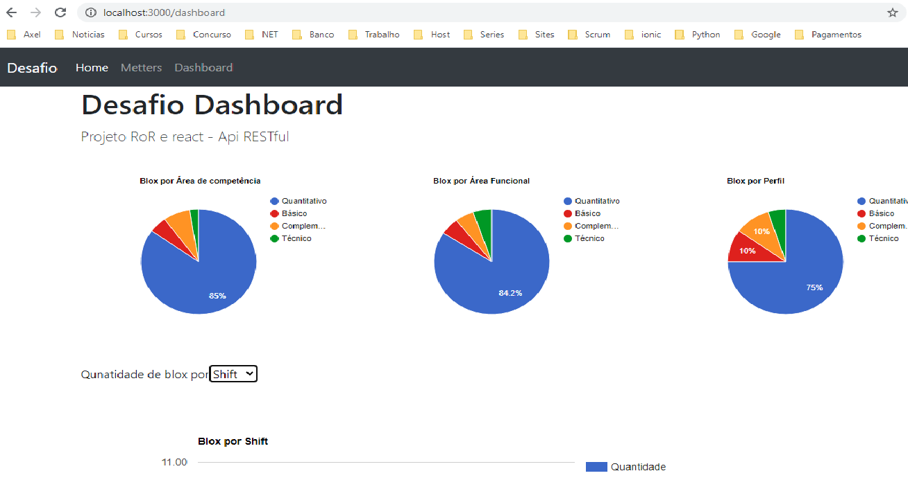
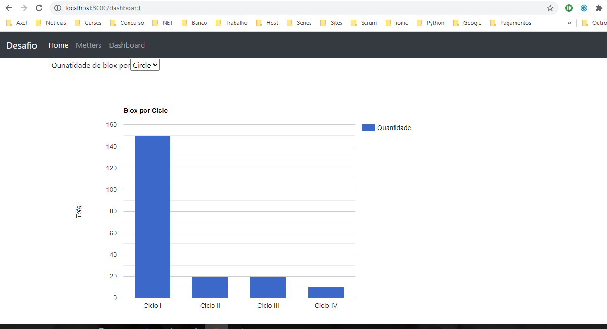

# README

Projeto desafio Joinus.

# Screem






# Things you may want to cover:

* Ruby version `2.5.5`

* Rails version `Rails 5.2.4.3`

* System dependencies  `Gemfile and packages.json`

* Database creation `sqlite`

* Database initialization `rails db:create`

* Deployment instructions
    * bundle install
    
    * rails db:create

    * rails db:migrate

    * rails db:seed

    * yarn install

    * rails s 


# Projeto -cmd

    * rails g controller home index
    * rails g model Metter title:string active:boolean
    * rails g model KnowledgeArea title metter:references
    * rails generate model Recipe name:string ingredients:text instruction:text image:string
    * rails generate migration add_total_to_knowledgearea total:integer
    * rails g model FunctionalArea title:string total:integer metter:references
    * rails g model Profile title:string total:integer metter:references
    * rails g controller api/v1/metters


# Migrate
    rails db:create

    rails db:migrate

    rails db:seed


```json
[
    {
        "id": 1,
        "title": "Matematica",
        "knowledge_area"  : { "id": 1, "name" : "Quantitativo", "id": 2, "name" : "Básico"  },
        "functional_area" : { "id": 1, "name" : "Quantitativo", "id": 2, "name" : "Básico"  }
        "blox_profile"    : { "id": 1, "name" : "Quantitativo", "id": 2, "name" : "Básico"  }
        "circle"          : { "id": 1, "name" : "Ciclo", "id": 2, "name" : "Básico"  }
        "shift"           : { "id": 1, "name" : "Matutino", "id": 2, "name" : "Noturno"  }
    }
]
```


# git
  - $ git init
  - $ git config --global user.name "nome"
  - $ git config --global user.email blabla@gmail.com
  - $ ls .git
  - $ git remote add origin git@github.com:codpuer/tutorial-github.git

# Author


